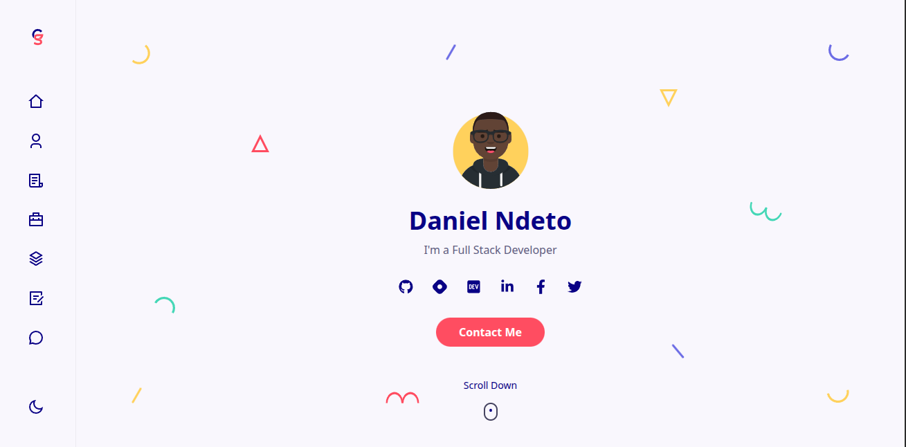

<h1 align="center">
  <br>
  <a href="https://dn-nu.vercel.app/">
  </a>
  <br>
  Daniel Ndeto"s Personal Website
  <br>
</h1>

<h4 align="center">A simple personal website about <a href="https://dn-nu.vercel.app/" target="_blank">Daniel Ndeto</a>.</h4>

<br>
<br>



## How To Use

To clone and run this application, you'll need [Git](https://git-scm.com) and [Node.js](https://nodejs.org/en/download/). From your command line:

```bash
# Clone this repository
$ git clone https://github.com/daniel-ndeto/dan.git

# Go into the repository
$ cd dan-react-portfolio

# Install dependencies
$ yarn install

# Run the app
$ yarn start
```

## thank you for using my website
[](https://www.buymeacoffee.com/danielndeto)
